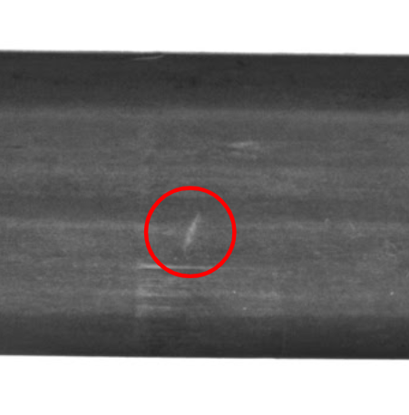
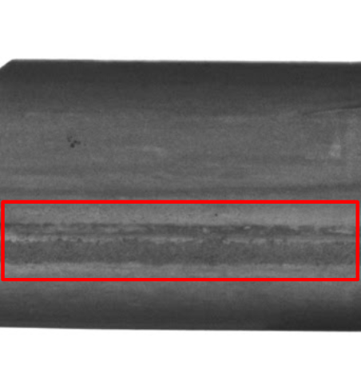
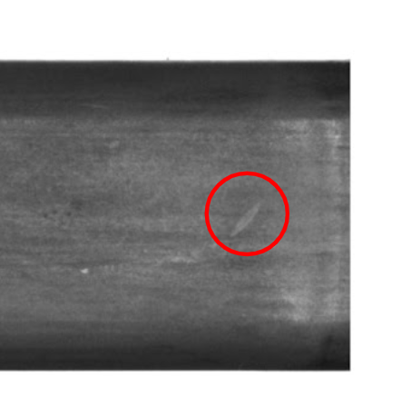
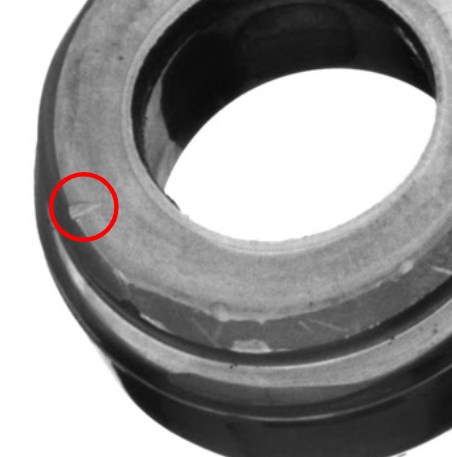
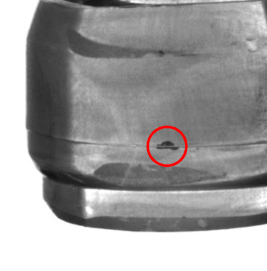
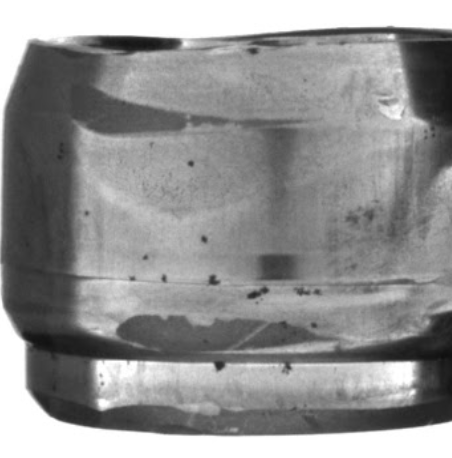
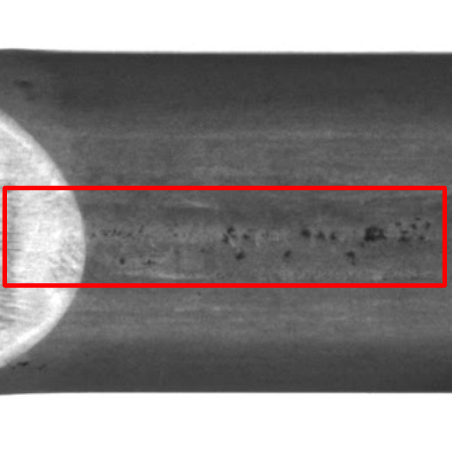

## 1. Introduction
This repository provides the dataset for SOMIC project. Users mainly work on `DVC/dataset` directory which stores `color_images/`, `gray_images`, `masks/` and `info.csv`.  All the images and masks are in these directories. By passing the query to `info.csv`, users can get the desired dataset. If you want to know more, please see `3. info.csv` and `4. Query Recipes`. This repository is available in DGX `/dgx/shared/momo/inoue/DVC`.

<br>


## 2. Label and Flag
This dataset has two type of annotation: `label` and `flag`. `label` is the annotation assigned to each pixel, and `flag` is the annotation assigned to each image.
The following tables are description about `label` and `flag`.

<br>

| Label Name     | Description |
| :-             | :-          |
| kizu_dakon     | カシメ部割れ, 切断面スジ, カシメ段ヒケ |
| kizu_ware      | 打痕, カシメ段差, カス打ち込み, カス打ち残り, 異物打ち込み, カシメ内径キズ, 内径キズ |
| kizu_zairyou   | 材料キズ |
| ignore_shallow | The kizu is shallow and can be ignored |
| ignore_cutting | The kizu will be removed in a later process |
| ignore_oil     | The oil stain failed to be wiped off |

<br>

| Flag Name | Description |
| :-        | :-          |
| sabi      | The image with rust (錆 sabi) |
| unuse     | The deprecated image for train and test |

The image with rust rarely appear in production phase, because the product is created and then take a image imidiately.
However, the products put in a laboratory for a week. That's why the products are getting rust.
The images with rust are deprecated for train and test.

<br>

### ■ Examples

Still working... Please wait for a few days...

| label: kizu_dakon                                      | label: kizu_ware                                      | label: kizu_zairyou                                      |
| --                                                     | --                                                    | --                                                       |
|  |  |  |

| label: ignore_shallow                                  | label: ignore_cutting                                          | label: ignore_oil                                      |
| --                                                     | --                                                             | --                                                     |
|  |  |  |

| flag: sabi                                       | flag: unuse                                      |                            |
| --                                               | --                                               | --                         |
|  | |  |


<br>


## 3. info.csv

| Variable           | Description                                                 | Type | Key |
| :-                 | :-                                                          | :-   | :-  |
| raw_product_id     | The original product id                                     | int  | - |
| product_id         | `timestamp` at camera angle 0                               | int  | yyyymmddhhmmssmmm |
| camera_id          | The imaging device                                          | int  | 1 (end of body), 2 (whole), 3 (inside of head), 4 (top of head) |
| camera_angle       | Camera angle                                                | int  | 0-7 (camera 1), 0-11 (camera 2), 0-4 (camera 3), 0 (camera 4) |
| crop_type          | The type of crop                                            | str  | uncrop, tobu (at camera_id 2), ziku (at camera_id 2) |
| color_type         | The type of color                                           | str  | gray, color |
| raw_stem           | Raw filename without its suffix                             | str  | `[raw_product_id]_[timestamp]` |
| stem               | Renamed filename without its suffix                         | str  | `[product_id]_[crop_type]_[angle]` |
| product_type       | The type of product                                         | str  | B, C, H, K, RAV4, Y1J, YJA |
| received_date      | The date when we received raw datasets                      | int  | yyyymmdd |
| timestamp          | The time the image was captured                             | int  | yyyymmddhhmmssmmm |
| is_anomaly_image   | Does the image have kizu?                                   | int  | 1 (Yes), 0 (No) |
| is_anomaly_product | Does the product have kizu?                                 | int  | 1 (Yes), 0 (No) |
| has_kizu_dakon     | Does the image have `kizu_dakon` label?                     | int  | 1 (Yes), 0 (No) |
| has_kizu_ware      | Does the image have `kizu_ware` label?                      | int  | 1 (Yes), 0 (No) |
| has_kizu_zairyou   | Does the image have `kizu_zairyou` label?                   | int  | 1 (Yes), 0 (No) |
| has_ignore_shallow | Does the image have `ignore_shallow` label?                 | int  | 1 (Yes), 0 (No) |
| has_ignore_cutting | Does the image have `ignore_cutting` label?                 | int  | 1 (Yes), 0 (No) |
| has_ignore_oil     | Does the image have `ignore_oil` label?                     | int  | 1 (Yes), 0 (No) |
| has_sabi           | Does the image have `sabi` flag?                            | int  | 1 (Yes), 0 (No) |
| has_unuse          | Does the image have `unuse` flag?                           | int  | 1 (Yes), 0 (No) |
| data_block_id      | The raw dataset is split into 10 blocks with ID from 0 to 9 | int  | 0-9 |

<br>

## 4. Query Recipes
By passing the query to info.csv, you can get the desired dataset.
[example.ipynb](https://github.com/TaikiInoue/DVC/blob/master/examples/example.ipynb) is also useful, so check it out.

<br>

### 4.1. Supervised Dataset

```
dataset:
  train:
    args:
      base: [path to dataset directory]
      color_type: color
      suffix: jpg
      query:
      - product_type == 'H' &
        camera_id == 2 &
        crop_type == 'tobu' &
        is_anomaly_image == 1 &
        has_sabi == 0 &
        has_unuse == 0 &
        data_block_id < 7
  val:
    args:
      base: [path to dataset directory]
      color_type: color
      suffix: jpg
      query:
      - product_type == 'H' &
        camera_id == 2 &
        crop_type == 'tobu' &
        is_anomaly_image == 1 &
        has_sabi == 0 &
        has_unuse == 0 &
        data_block_id == 7
  test:
    args:
      base: [path to dataset directory]
      color_type: color
      suffix: jpg
      query:
      - product_type == 'H' &
        camera_id == 2 &
        crop_type == 'tobu' &
        is_anomaly_image == 1 &
        has_sabi == 0 &
        has_unuse == 0 &
        data_block_id > 7
```

<br>

### 4.1. Semi-Supervised Dataset

```
dataset:
  labeled_train:
    args:
      base: [path to dataset directory]
      color_type: color
      suffix: jpg
      query:
      - product_type == 'H' &
        camera_id == 2 &
        crop_type == 'tobu' &
        is_anomaly_image == 1 &
        has_sabi == 0 &
        has_unuse == 0 &
        data_block_id < 3
  unlabeled_train:
    args:
      base: [path to dataset directory]
      color_type: color
      suffix: jpg
      query:
      - product_type == 'H' &
        camera_id == 2 &
        crop_type == 'tobu' &
        is_anomaly_image == 1 &
        has_sabi == 0 &
        has_unuse == 0 &
        data_block_id >= 3
        data_block_id < 7
  val:
    args:
      base: [path to dataset directory]
      color_type: color
      suffix: jpg
      query:
      - product_type == 'H' &
        camera_id == 2 &
        crop_type == 'tobu' &
        is_anomaly_image == 1 &
        has_sabi == 0 &
        has_unuse == 0 &
        data_block_id == 7
  test:
    args:
      base: [path to dataset directory]
      color_type: color
      suffix: jpg
      query:
      - product_type == 'H' &
        camera_id == 2 &
        crop_type == 'tobu' &
        is_anomaly_image == 1 &
        has_sabi == 0 &
        has_unuse == 0 &
        data_block_id > 7
```

<br>

### 4.1. Un-Supervised Dataset

```
dataset:
  train:
    args:
      base: [path to dataset directory]
      color_type: color
      suffix: jpg
      query:
      - product_type == 'H' &
        camera_id == 2 &
        camera_angle == 11 &
        crop_type == 'tobu' &
        is_anomaly_image == 0 &
        has_sabi == 0 &
        has_unuse == 0 &
        data_block_id < 7
  test:
    args:
      base: [path to dataset directory]
      color_type: color
      suffix: jpg
      query:
      - product_type == 'H' &
        camera_id == 2 &
        camera_angle == 11 &
        crop_type == 'tobu' &
        is_anomaly_image == 1 &
        has_sabi == 0 &
        has_unuse == 0 &
        data_block_id > 7
```

<br>

## 5. Prepare v1.0.0 Dataset in Your Machine

a) Start docker container from `PyTorch+CUDA` image on JupyterHub

b) Download this repository
```
git clone git@github.com:TaikiInoue/DVC.git
cd DVC
```

c) Install python requirements
```
pip install -r requirements.txt
```

d) Register `connection_string`. If you don't know how to get it, please contact Inoue or Shamik.
```
dvc remote modify --local blob_storage connection_string [azure_storage_connection_string]
```

e) Download *.zip file
```
make dvc_pull
```

f) Prepare the dataset from raw datasets
```
make dvc_repro
```
